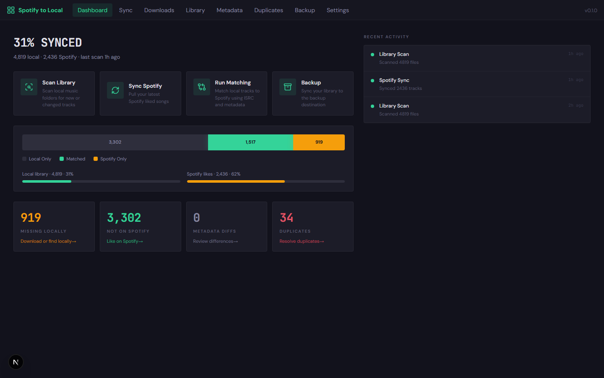
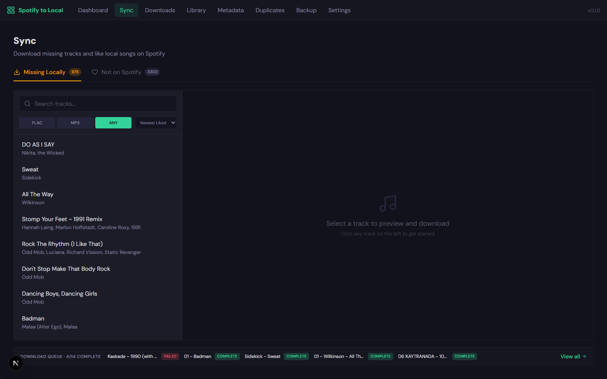
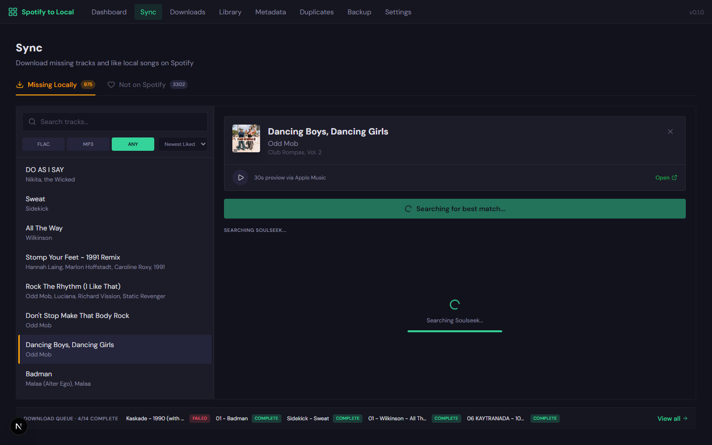
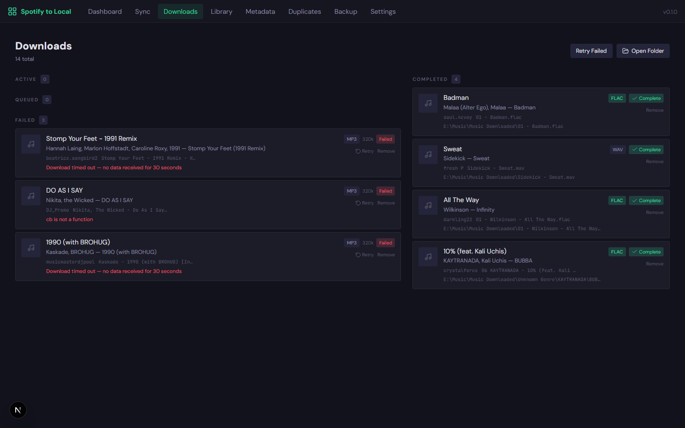
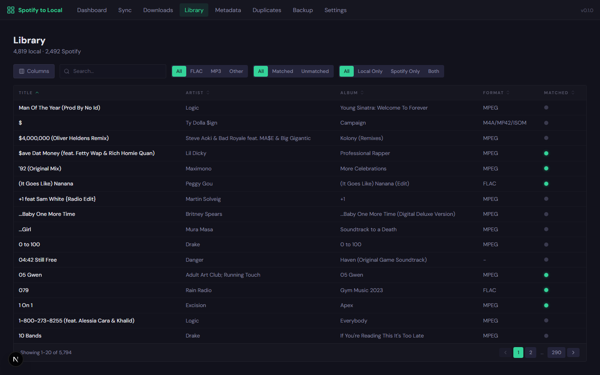
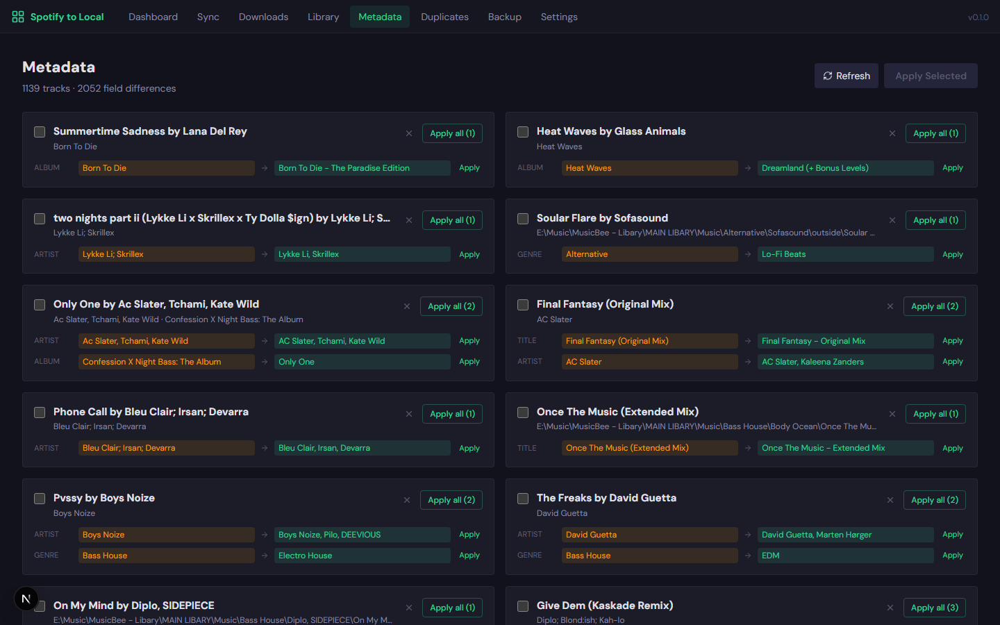
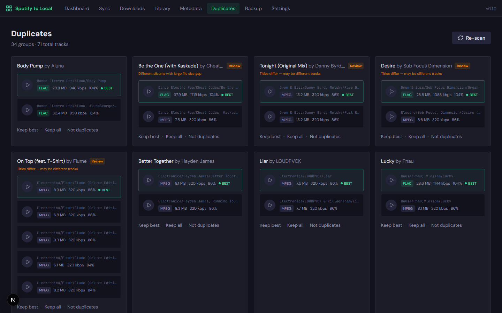
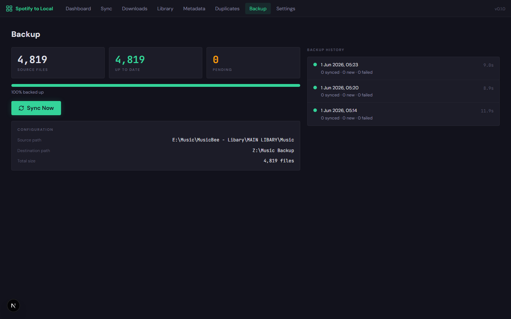
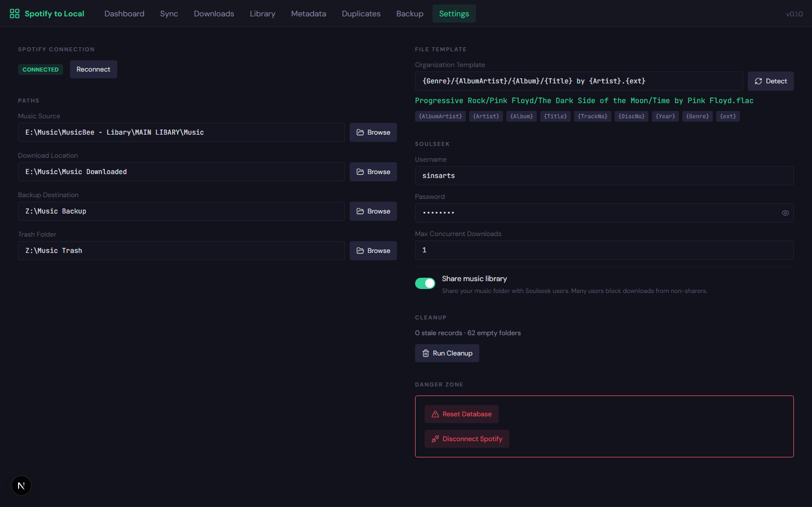

# Spotify Local Sync

A self-hosted web app that bridges your local music collection with Spotify. Scan your library, match tracks, find gaps, download missing songs via Soulseek, manage metadata, detect duplicates, and back up your collection — all from one dashboard.



## Features

- **Library Scanning** — Recursively scans your local music folder (MP3, FLAC, M4A, OGG, WAV, AIFF) and extracts metadata including embedded artwork detection
- **Spotify Sync** — Connects via OAuth to pull your liked songs, album art URLs, and artist genres
- **Smart Matching** — Three-stage waterfall: ISRC exact match, case-insensitive title+artist, fuzzy normalized matching with duration comparison
- **Download Missing Tracks** — Search Soulseek, preview via Spotify/Apple Music, pick format/quality, download with auto-tagging. Auto-retries with alternate users on timeout
- **Like on Spotify** — Find local tracks not in your Spotify likes and bulk-like them
- **Unified Library** — Browse your entire collection (local + Spotify) in a sortable, filterable table with toggleable columns
- **Metadata Manager** — Compare local tags against Spotify (title, artist, album, genre, artwork), review diffs on cards, apply individually or in bulk
- **Duplicate Detection** — Three-pass detection (ISRC match, exact duration, loose duration for remixes), quality scoring, audio preview, ignore false positives
- **Backup Sync** — Non-blocking one-way file sync with real-time progress bar, cancel support, and run history
- **File Organization** — Configurable path template with auto-detection from your existing library structure

## Screenshots

<details>
<summary>Click to view all pages</summary>

### Sync — Download missing tracks
Split panel with search, quality filter, sort, Spotify preview, and Soulseek results.



### Sync — Track detail with preview
Album art, 30s audio preview (Spotify/Apple Music), best match button, and Soulseek search results.



### Downloads — Queue management
Two-column layout with active/queued/failed on the left, completed on the right.



### Library — Unified collection browser
All local + Spotify tracks in one sortable, filterable table with toggleable columns.



### Metadata — Tag comparison
Card-based layout showing field diffs (title, artist, album, genre, artwork) with per-field Apply buttons.



### Duplicates — Find and resolve
ISRC-based and title+artist matching with quality scores, audio preview, and review badges.



### Backup — File sync with progress
Non-blocking sync with real-time progress bar, history log, and cancel support.



### Settings — Configuration
Spotify connection, native folder picker, file template with detection, Soulseek sharing, danger zone.



</details>

## Tech Stack

| Component | Technology |
|-----------|-----------|
| Framework | Next.js 16 (App Router) |
| Frontend | React 19, Tailwind CSS v4, Lucide icons |
| Database | SQLite via better-sqlite3 (WAL mode) |
| Metadata | music-metadata (reading), node-id3 (MP3 writing), metaflac (FLAC writing) |
| P2P | slsk-client (Soulseek) |
| Matching | string-similarity (Dice coefficient) |
| Real-time | Server-Sent Events (SSE) for progress streaming |

## Prerequisites

- **Node.js** 20+
- **Spotify Developer App** — [developer.spotify.com/dashboard](https://developer.spotify.com/dashboard)
- **Soulseek account** — [slsknet.org](http://www.slsknet.org/) (for downloading)
- **metaflac** (optional) — for writing FLAC metadata tags (install via your package manager or [xiph.org](https://xiph.org/flac/download.html))

## Quick Start

### 1. Clone and install

```bash
git clone https://github.com/Sins369/spotify-local-sync.git
cd spotify-local-sync
npm install
```

### 2. Configure Spotify

1. Go to [Spotify Developer Dashboard](https://developer.spotify.com/dashboard)
2. Create a new app
3. Add `http://127.0.0.1:3000/api/spotify/callback` as a **Redirect URI**
4. Copy the **Client ID**

### 3. Create environment file

```bash
cp .env.example .env.local
```

Edit `.env.local`:

```env
SPOTIFY_CLIENT_ID=your_client_id_here
NEXT_PUBLIC_BASE_URL=http://127.0.0.1:3000
```

### 4. Start

```bash
npm run dev
```

Open **http://127.0.0.1:3000** in your browser.

### 5. Configure in Settings

1. **Connect Spotify** — click Connect, authorize in the popup
2. **Music Source** — path to your music library
3. **Download Location** — where Soulseek downloads go
4. **Backup Destination** — where backup copies are stored
5. **Trash Folder** — where deleted duplicates are moved
6. **Soulseek** — username, password, and optionally enable library sharing (reduces download blocks from other users)
7. **File Template** — click **Detect** to auto-match your existing folder structure

### 6. First sync

From the Dashboard, run these in order:

1. **Scan Library** — indexes all local tracks with metadata and artwork detection
2. **Sync Spotify** — pulls liked songs, album art, and artist genres
3. **Run Matching** — links local tracks to Spotify (~1 min for 5000 tracks)

## How Matching Works

Runs entirely against the local SQLite database — no Spotify API calls after initial sync:

| Stage | Method | Confidence |
|-------|--------|------------|
| 1 | ISRC exact match | 99% |
| 2 | Case-insensitive title + artist | 98% |
| 3 | Normalized fuzzy match (strips feat., remastered, deluxe, punctuation) | 75-95% |

## How Duplicate Detection Works

Three-pass detection to catch different types of duplicates:

| Pass | Method | Example |
|------|--------|---------|
| 1 | Same ISRC code | Same recording on different albums |
| 2 | Same title+artist, duration within 5s | Exact duplicates in different folders |
| 3 | Same title+artist, duration within 60s | Single vs album version, radio edit vs extended |

Pass 3 results are flagged with a **Review** badge since they may be intentionally different versions.

## File Organization

Auto-detected from your library. Common patterns:

```
{Genre}/{AlbumArtist}/{Album}/{Title} by {Artist}.{ext}
{AlbumArtist}/{Album}/{TrackNo} {Title}.{ext}
{Artist}/{Album}/{TrackNo} - {Title}.{ext}
```

Variables: `{AlbumArtist}`, `{Artist}`, `{Album}`, `{Title}`, `{Genre}`, `{TrackNo}`, `{DiscNo}`, `{Year}`, `{ext}`

## Architecture

```
+--------------------------------------------------+
|              Next.js App (localhost)              |
|                                                  |
|  Top Nav Bar                                     |
|  9 pages: Dashboard, Sync, Downloads, Library,   |
|           Metadata, Duplicates, Backup, Settings |
|                                                  |
|  API Routes          Event Bus (SSE)             |
|  /api/scan           real-time progress for      |
|  /api/spotify        scan, match, backup         |
|  /api/match                                      |
|  /api/soulseek       Background Workers          |
|  /api/metadata       download queue processor    |
|  /api/duplicates     backup file copier          |
|  /api/backup                                     |
|  /api/library        SQLite (WAL mode)           |
|  /api/activity       data/sync.db                |
|  /api/settings                                   |
+--------------------------------------------------+
```

## API Reference

<details>
<summary>Click to expand all endpoints</summary>

### Scan
- `POST /api/scan` — trigger library scan
- `GET /api/scan/progress` — SSE progress stream
- `GET /api/scan/stats` — dashboard statistics

### Spotify
- `GET /api/spotify/auth` — initiate OAuth
- `GET /api/spotify/callback` — OAuth callback
- `POST /api/spotify/sync` — sync liked songs (includes album art + artist genres)
- `POST /api/spotify/like` — like tracks on Spotify
- `GET /api/spotify/status` — connection status
- `GET /api/spotify/preview?id=` — get 30s preview URL (Spotify with Apple Music fallback)

### Matching
- `POST /api/match/run` — run matching engine
- `GET /api/match/progress` — SSE progress stream
- `GET /api/match/results?filter=` — results (confirmed, probable, missing_locally, missing_on_spotify)
- `POST /api/match/confirm` — confirm/reject match

### Soulseek
- `POST /api/soulseek/connect` — connect (with optional library sharing)
- `POST /api/soulseek/search` — search tracks
- `POST /api/soulseek/download` — queue download
- `GET /api/soulseek/queue` — download queue with live progress
- `POST /api/soulseek/cancel` — cancel download
- `POST /api/soulseek/retry-failed` — retry all failed downloads
- `POST /api/soulseek/clear-queue` — cancel all queued downloads
- `GET /api/soulseek/failed-users?track_id=` — users that failed for a track

### Library
- `GET /api/library` — unified library (local + Spotify) with filters, sort, pagination

### Metadata
- `GET /api/metadata/diffs` — metadata differences (title, artist, album, genre, artwork)
- `POST /api/metadata/apply` — apply tag changes to files

### Duplicates
- `GET /api/duplicates` — duplicate groups
- `POST /api/duplicates` — detect duplicates (ISRC + title+artist + duration)
- `POST /api/duplicates/resolve` — resolve (keep_one, keep_all, ignore)

### Backup
- `GET /api/backup/status` — sync status
- `POST /api/backup/sync` — start backup (non-blocking)
- `DELETE /api/backup/sync` — cancel running backup
- `GET /api/backup/progress` — SSE progress stream
- `GET /api/backup/history` — backup run history

### Activity
- `GET /api/activity` — recent activity log (last 50 entries)
- `POST /api/activity` — log an activity entry

### Other
- `GET/POST /api/settings` — read/write settings
- `POST /api/folder-picker` — native Windows folder picker dialog
- `POST /api/detect-template` — auto-detect file organization template
- `GET /api/preview?path=` — audio file streaming
- `GET/POST /api/cleanup` — stale record/empty folder cleanup
- `POST /api/open-folder` — open folder in Windows Explorer

</details>

## Disclaimer

This tool is intended for **personal use** to manage music you legally own. Users are solely responsible for ensuring their use of this software complies with applicable laws in their jurisdiction, including copyright law.

The developers do not condone or encourage copyright infringement. The Soulseek integration is provided for obtaining copies of music you have already purchased or have the right to access. Downloading copyrighted material without authorization may violate the law in your country.

This project is not affiliated with, endorsed by, or associated with Spotify, Soulseek, or Apple.

## License

MIT
